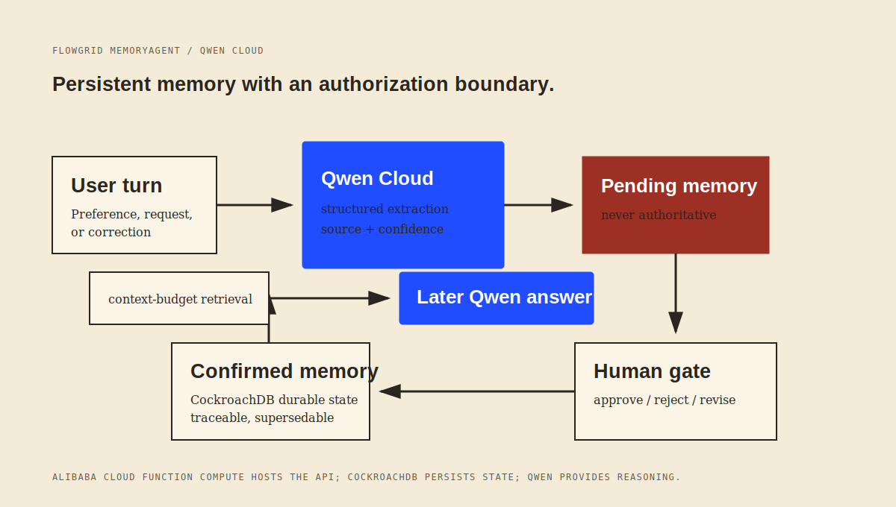

# FlowGrid MemoryAgent for Qwen Cloud

> Persistent memory should not give an AI authority it has not earned.

FlowGrid MemoryAgent is a Qwen-powered cross-session agent for durable human judgment. It turns a user turn into a **pending memory candidate**, requires human authorization before that candidate can affect future answers, and retrieves only confirmed memory within a fixed context budget.

## Why this is a new Qwen Cloud project

The existing FlowGrid project is a local-first ledger and host protocol. This repository is a separate hackathon implementation added during the Qwen Cloud hackathon period:

- Qwen Cloud performs structured memory extraction and answer synthesis.
- The agent maintains sources, candidate status, confirmation state, and supersession metadata across sessions.
- A conflicting request becomes a pending revision instead of silently overwriting confirmed judgment.
- The deployed version will run on Alibaba Cloud Function Compute.

This repository does **not** claim that the existing FlowGrid product has moved to the cloud.

## Architecture

```text
User turn
  -> Qwen Cloud structured extraction
  -> persistent source + pending memory candidate
  -> human authorization gate
  -> confirmed memory only
  -> constrained retrieval for a future Qwen answer
```

The browser demo exposes the lifecycle: add a user turn, authorize its candidate memory, then ask a later-session question. Pending revisions are visible but never used to answer.



## Local run

Requires Node.js 20+.

```bash
cp .env.example .env
npm run dev
open http://localhost:8787
```

For a real Qwen run, export a Qwen Cloud pay-as-you-go API key:

```bash
export DASHSCOPE_API_KEY="sk-..."
unset DEMO_MODE
npm run dev
```

Qwen Cloud uses an OpenAI-compatible endpoint by default. A real Qwen lifecycle has been verified; see [validation evidence](docs/REAL_QWEN_VALIDATION.md). The local `DEMO_MODE=mock` fallback exists only to test the authorization lifecycle before credentials are available. It must not be used as proof of Qwen integration in a hackathon submission.

## Verification

```bash
npm test
npm run evaluate
npm run demo
```

The evaluation asserts that a confirmed local-first preference persists across sessions and a conflicting cloud-first request stays pending.

## Deployment status

The demo is deployed to Alibaba Cloud Function Compute. Its current `/tmp` store survives while an instance stays warm, but it is not durable across cold starts. See [infra/README.md](infra/README.md) for the persistence boundary.

The current HTTP trigger uses signature authentication to protect the Qwen quota. A publicly shareable demo requires an application-level rate limit or a separate read-only presentation surface before that authentication can be relaxed.

## Submission readiness

See [the checklist](docs/SUBMISSION_CHECKLIST.md). The local lifecycle works in mock mode; real Qwen Cloud invocation and Alibaba Cloud deployment remain required before a valid submission.

## License

[MIT](LICENSE)
